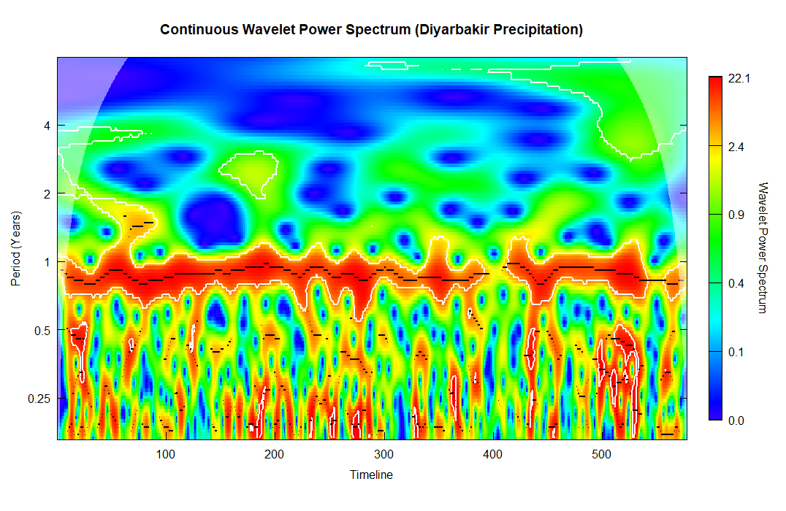
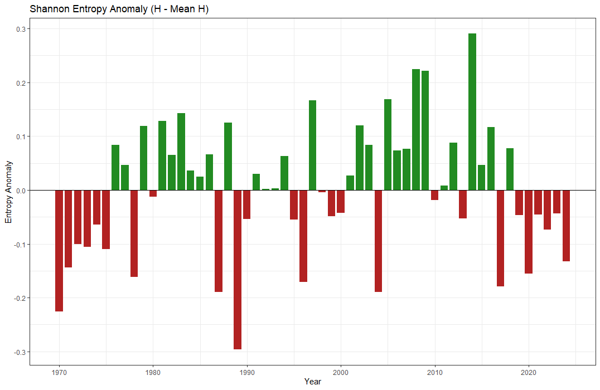
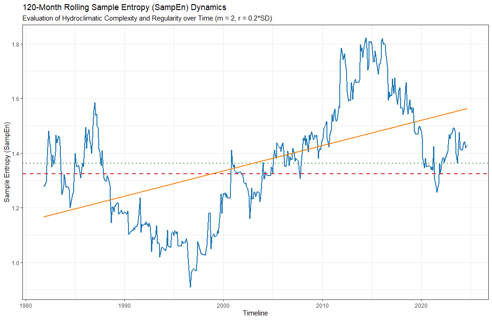
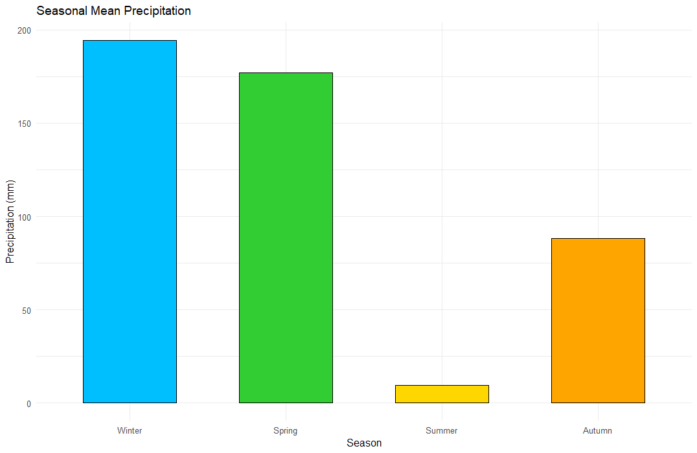
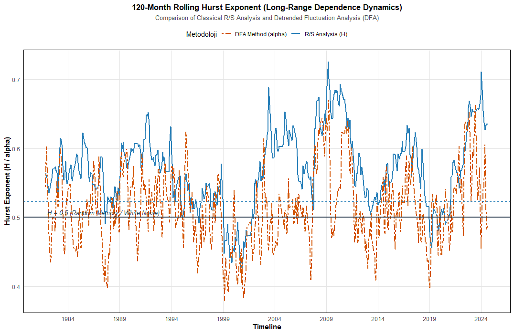
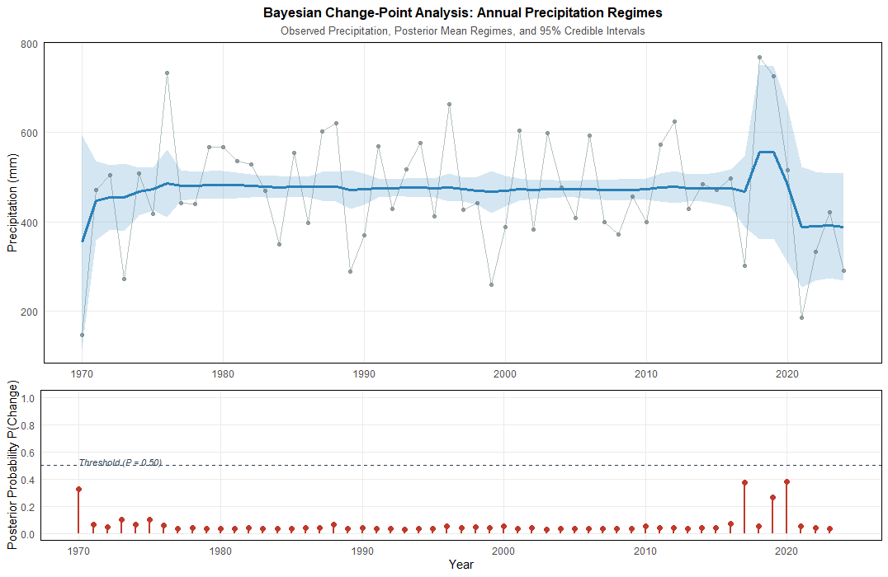
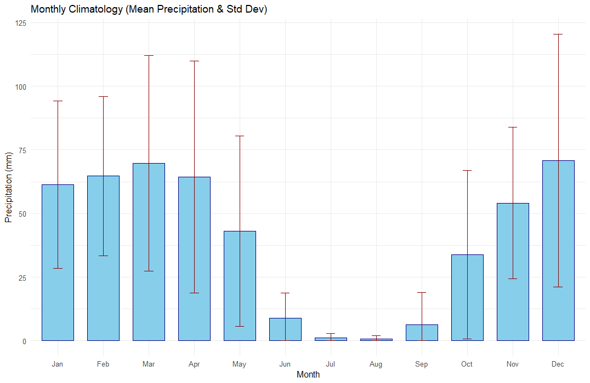
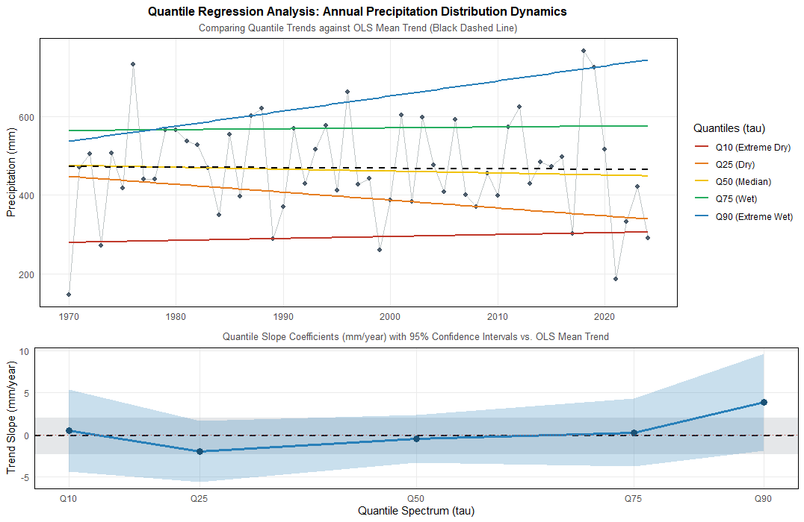
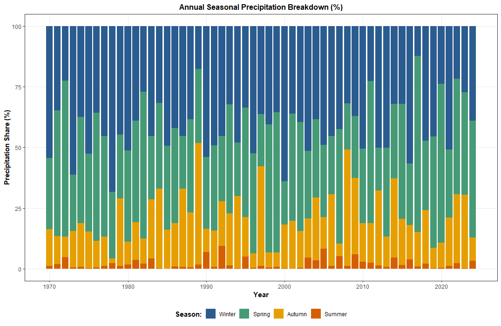
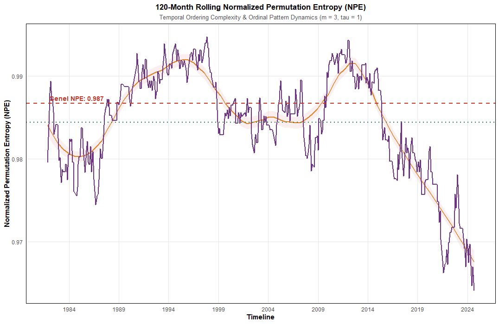

# Dynamics, Complexity, Memory, and Structural Changes in Monthly Precipitation in Diyarbakır, Türkiye

## 🌧️ Key Results

This project investigates whether the monthly precipitation system of Diyarbakır has changed not only in magnitude, but also in its **temporal organization, complexity, memory, frequency structure, and statistical regimes**.

The analysis integrates conventional precipitation climatology with information-theoretical, nonlinear, long-memory, time-frequency, structural-break, regime, and distributional approaches.

---

## 📊 Main Results at a Glance

### Monthly Precipitation Dynamics



### Annual and Seasonal Precipitation Variability



### Precipitation Concentration



---

# 🧠 Complexity Analysis

## Shannon Entropy

Shannon entropy is used to characterize the temporal distribution and concentration structure of precipitation.



The analysis examines whether precipitation has become increasingly concentrated within particular periods of the year or whether its temporal distribution has become more diversified.

---

## Sample Entropy

Sample Entropy is used to quantify the temporal complexity and regularity of the precipitation sequence.



The temporal evolution of entropy provides an additional perspective on whether the internal organization of precipitation has remained stable or changed through time.

---

## Permutation Entropy

Permutation Entropy evaluates the ordinal structure of the precipitation sequence and provides a complementary measure of dynamical complexity.



Together, Shannon Entropy, Sample Entropy, and Permutation Entropy provide complementary information on the distributional and temporal complexity of the precipitation process.

---

# 🧠 Memory and Persistence

## Hurst Exponent

The Hurst exponent is used to investigate persistence and long-range dependence within the monthly precipitation series.



The analysis evaluates whether precipitation exhibits persistent, approximately memoryless, or anti-persistent behavior.

Importantly, the Hurst exponent is interpreted as a measure of temporal dependence rather than direct evidence of a specific physical climate mechanism.

---

# 🌊 Time-Frequency Dynamics

## Continuous Wavelet Transform

Wavelet analysis investigates precipitation variability simultaneously in the time and frequency domains.



The Wavelet Power Spectrum is used to identify dominant temporal scales and to determine whether the intensity of particular periodicities changes through time.

This allows the precipitation series to be evaluated as a **non-stationary process operating across multiple temporal scales**.

---

# 🔴 Structural Changes

## Bayesian Change-Point Analysis

Bayesian change-point detection is used to identify statistically supported changes in the structure of the precipitation time series.



Rather than assuming a predetermined breakpoint, the analysis estimates the probability and location of potential structural changes from the observed precipitation record.

---

# 🔄 Precipitation Regimes

Following the identification of structural change points, different periods of the precipitation record are evaluated as potential hydroclimatic regimes.

Each regime is compared in terms of:

- Mean precipitation
- Variability
- Coefficient of variation
- Seasonality
- Concentration
- Entropy
- Persistence
- Temporal structure



The objective is to determine whether the precipitation system exhibits different statistical and dynamical characteristics across distinct periods.

---

# 📈 Distributional Changes

## Quantile Regression

Quantile regression is used to examine whether precipitation changes are uniform across the distribution.

The analysis considers multiple conditional quantiles, including:

- 10th percentile
- 25th percentile
- 50th percentile
- 75th percentile
- 90th percentile


This approach allows the study to distinguish between changes affecting low, median, and high precipitation conditions.

---

# 🔬 Research Question

The central question of this project is:

> **Has the monthly precipitation system of Diyarbakır changed only in magnitude, or have its distribution, complexity, memory, frequency structure, and statistical regimes also changed over time?**

---

# 🎯 Research Objectives

The project addresses eight principal objectives:

1. Characterize the seasonal and interannual variability of monthly precipitation.
2. Quantify changes in precipitation concentration and temporal distribution.
3. Evaluate the temporal complexity of the precipitation sequence.
4. Investigate long-range dependence and persistence.
5. Identify dominant temporal scales using wavelet analysis.
6. Detect statistically supported structural changes.
7. Compare precipitation characteristics across different regimes.
8. Determine whether changes differ across the precipitation distribution.

---

# 🧪 Analytical Framework

```text
Monthly Precipitation
        │
        ▼
Data Quality Control
        │
        ▼
Climatological Analysis
        │
        ▼
Precipitation Concentration
        │
        ├───────────────┐
        ▼               ▼
Shannon Entropy     Quantile Structure
        │
        ▼
Sample Entropy
        │
        ▼
Permutation Entropy
        │
        ▼
Hurst Exponent
        │
        ▼
Wavelet Analysis
        │
        ▼
Bayesian Change Points
        │
        ▼
Precipitation Regimes
        │
        ▼
Integrated Interpretation
# 📚 Methodological Components

The methodological framework is designed to investigate monthly precipitation as a multidimensional temporal process. Each analytical component addresses a specific characteristic of precipitation dynamics.

| Analytical Dimension | Method | Main Purpose |
|---|---|---|
| Precipitation magnitude | Climatological Statistics | Characterize the basic precipitation regime |
| Seasonality | Monthly and Seasonal Analysis | Identify the intra-annual precipitation structure |
| Precipitation concentration | Concentration Metrics | Quantify the temporal concentration of precipitation |
| Distributional complexity | Shannon Entropy | Evaluate the distributional organization of precipitation |
| Temporal complexity | Sample Entropy | Quantify temporal regularity and complexity |
| Ordinal complexity | Permutation Entropy | Examine the ordering structure of precipitation |
| Long-range dependence | Hurst Exponent | Assess persistence and memory |
| Multi-scale variability | Continuous Wavelet Transform | Identify dominant temporal scales |
| Structural change | Bayesian Change-Point Detection | Identify potential regime transitions |
| Regime dynamics | Regime Analysis | Compare precipitation characteristics between periods |
| Distributional change | Quantile Regression | Examine changes across different precipitation quantiles |

---

# 📊 Results Framework

The project does not interpret precipitation change through a single statistical indicator. Instead, the results are organized into several complementary dimensions.

### 1. Magnitude

The first level evaluates how much precipitation occurs and how strongly it varies between months, seasons, and years.

### 2. Distribution

The second level investigates how precipitation is distributed throughout the year and whether precipitation becomes increasingly concentrated within specific periods.

### 3. Complexity

Entropy-based methods are used to determine whether the temporal organization of precipitation becomes more regular, more irregular, or dynamically different through time.

### 4. Memory

The Hurst exponent provides information about persistence and long-range dependence within the precipitation sequence.

### 5. Frequency Structure

Wavelet analysis identifies the temporal scales at which precipitation variability is concentrated and examines whether these structures remain stable through time.

### 6. Structural Change

Bayesian change-point analysis investigates whether statistically distinguishable changes occur within the precipitation record.

### 7. Regime Dynamics

The precipitation record is divided into statistically supported regimes, allowing the characteristics of different periods to be compared.

### 8. Distributional Behavior

Quantile regression evaluates whether precipitation changes occur uniformly across the distribution or whether low-, median-, and high-precipitation conditions behave differently.

---

# 🔬 Integrated Results Interpretation

The analytical results will be interpreted collectively rather than independently.

A conceptual interpretation framework is:

```text
                 MONTHLY PRECIPITATION
                         │
                         ▼
              ┌─────────────────────┐
              │ Magnitude & Variance │
              └──────────┬──────────┘
                         │
                         ▼
              ┌─────────────────────┐
              │ Seasonality &        │
              │ Concentration        │
              └──────────┬──────────┘
                         │
                         ▼
              ┌─────────────────────┐
              │ Temporal Complexity │
              │ Entropy Measures    │
              └──────────┬──────────┘
                         │
                         ▼
              ┌─────────────────────┐
              │ Memory & Persistence│
              │ Hurst Exponent      │
              └──────────┬──────────┘
                         │
                         ▼
              ┌─────────────────────┐
              │ Time-Frequency      │
              │ Wavelet Structure   │
              └──────────┬──────────┘
                         │
                         ▼
              ┌─────────────────────┐
              │ Structural Changes  │
              │ Bayesian CP         │
              └──────────┬──────────┘
                         │
                         ▼
              ┌─────────────────────┐
              │ Precipitation       │
              │ Regimes             │
              └──────────┬──────────┘
                         │
                         ▼
              ┌─────────────────────┐
              │ Quantile Behavior   │
              └──────────┬──────────┘
                         │
                         ▼
              INTEGRATED HYDROCLIMATIC
                    INTERPRETATION
